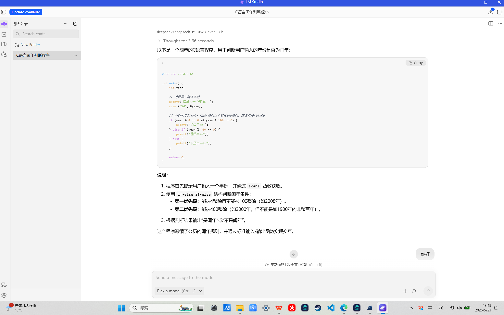

# 本地LLM部署对比实验：Ollama → LM Studio

> 记录我在个人电脑上部署大语言模型的尝试，以及从 Ollama 迁移到 LM Studio 的完整过程。

## 🎯 项目目标
在没有云端 GPU 的情况下，在本地运行 8B 参数的对话模型，并比较不同部署工具的易用性和效果。

## 🔧 实验环境
- 操作系统：Windows 11
- 内存：16GB
- 显卡：RTX 5060 Laptop 8GB
- 最终使用的模型：DeepSeek-R1-0528-Qwen3-8B、Qwen3-VL-4B

## 🧪 两次部署尝试

### 第一次尝试：Ollama
**状态**：❌ 已放弃

- **安装**：命令行安装顺利。
- **遇到的问题**：
  1. UI 界面过于简洁，许多功能依赖命令行且入口复杂。
  2. 查询资料后，对其长期以来的易用性不太看好。
- **放弃决定**：综合以上原因，决定卸载 Ollama，寻找更友好的替代品。

### 第二次尝试：LM Studio
**状态**：✅ 正在使用

- **安装**：图形化界面，下载安装包直接安装。
- **使用流程**：
  1. 在软件内搜索并下载 Qwen3-VL-4B 等模型。
  2. 在右侧加载模型，调整上下文长度等参数。
  3. 直接对话测试。
- **感受**：
  - **优点**：下载有进度条且稳定、界面直观、方便切换模型。
  - **缺点**：内存占用比 Ollama 高、推理速度略慢，模型加载速度也比较慢。

## 📊 对比总结

| 维度 | Ollama | LM Studio |
|------|--------|------------|
| 安装难度 | 简单（命令行） | 很简单（图形化） |
| 模型下载稳定性 | 一般 | 好 |
| 推理速度（token/秒）| 未关注 | 40+ |
| 内存占用 | 未关注 | 约 8GB |
| 是否支持 GPU | 是 | 是 |
| 适合场景 | 服务器端、自动化脚本 | 本地桌面、探索学习 |

## 💡 我学到了什么
1. **本地部署通用流程**：下载模型文件 → 用工具加载 → 推理对话 → 调整参数优化。
2. **量化格式认识**：GGUF 等量化格式让大模型能在普通消费级硬件上运行。
3. **工具选型经验**：在本地探索阶段，GUI 工具（LM Studio）比命令行工具（Ollama）调试更友好。
4. **遇到问题要换工具**：卡住时不必死磕，换一条路可能更高效。

## 📸 运行截图

## 🔮 后续计划
- [ ] 尝试用 LM Studio 开启 API 服务，接入一个简单的网页前端
- [ ] 对比不同量化级别（Q4_K_M、Q8_0）的效果差异
- [ ] 基于本地模型做一个简单的 RAG 问答 demo

## 🔗 相关资源
- [Ollama 官网](https://ollama.com/)
- [LM Studio 官网](https://lmstudio.ai/)
- [TheBloke 量化模型库](https://huggingface.co/TheBloke)
